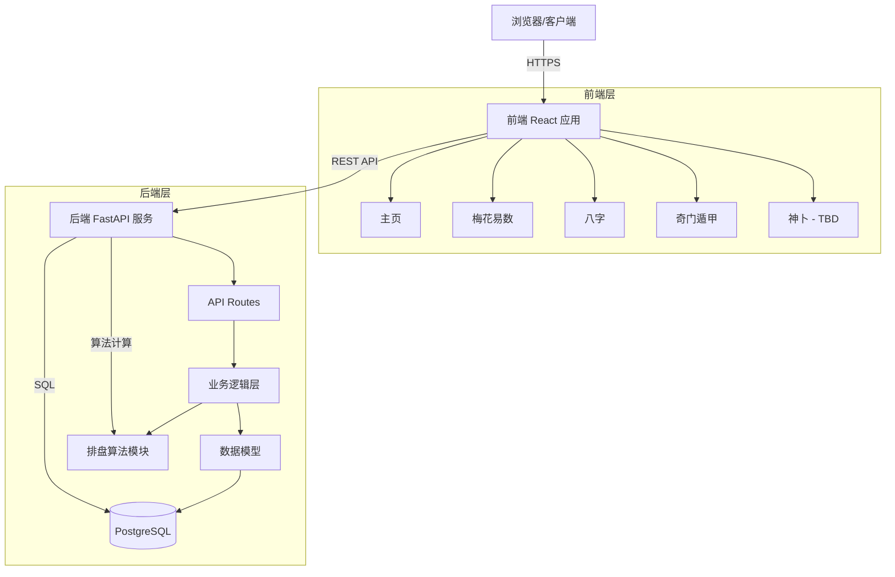

# Fortune Telling Platform Technical Design

Feature Name: 2026-05-28-fortune-telling-platform
Updated: 2026-05-28

## Description

本项目是一个提供梅花易数、奇门遁甲、八字、神卜四种传统占卜功能的排盘网站。采用前后端分离架构，前端使用 Vite + React + TypeScript 实现 Apple 风格的极简界面，后端使用 Python + FastAPI 提供排盘计算服务和数据存储（PostgreSQL）。

## Architecture



## Components and Interfaces

### 前端组件架构

#### 1. 核心组件

- **Layout 组件**: 包含导航栏、页脚、主内容区
- **Navigation 组件**: 顶部固定导航栏，含 Logo 和功能菜单
- **Home 页面**: 四个功能模块入口网格
- **功能页面组件**: 各排盘功能的独立页面

#### 2. 功能模块组件

每个排盘功能包含：
- **输入表单组件**: 收集用户输入参数
- **计算状态组件**: 显示加载进度
- **结果展示组件**: 展示排盘结果
- **历史记录组件**: 展示用户历史（后续）

#### 3. 技术栈

- Vite 5.x (构建工具)
- React 18.x (UI 框架)
- TypeScript 5.x (类型系统)
- TailwindCSS 3.x (样式框架)
- Framer Motion (动画库)
- React Router 6.x (路由管理)
- Axios (HTTP 客户端)

### 后端组件架构

#### 1. 核心服务

- **FastAPI 应用**: 主应用服务
- **路由层**: 定义 API 端点
- **业务逻辑层**: 排盘算法实现
- **数据访问层**: PostgreSQL 交互

#### 2. 算法模块

- **meihua 模块**: 梅花易数排盘算法
  - 卦象计算
  - 变卦推演
  - 卦辞爻辞解析
- **bazi 模块**: 八字排盘算法
  - 四柱计算（年月日时）
  - 天干地支转换
  - 十神五行分析
  - 大运流年推算
- **qimen 模块**: 奇门遁甲排盘算法
  - 九宫布局
  - 天盘地盘人盘神盘
  - 值符值使计算
  - 九星八门八神
- **shenbo 模块**: 神卜框架（待实现）

#### 3. 技术栈

- Python 3.11+
- FastAPI 0.100+
- SQLAlchemy 2.x (ORM)
- Asyncpg (PostgreSQL 异步驱动)
- Pydantic 2.x (数据验证)
- Uvicorn (ASGI 服务器)

## Data Models

### PostgreSQL 数据模型

```python
# 数据库表结构设计

class FortuneRecord(BaseModel):
    """排盘记录基础模型"""
    id: UUID
    user_id: Optional[UUID]  # 可选，为未来用户系统预留
    fortune_type: str  # 'meihua', 'bazi', 'qimen', 'shenbo'
    input_data: dict  # 输入参数 JSON
    output_data: dict  # 排盘结果 JSON
    created_at: datetime
    updated_at: datetime

class User(BaseModel):
    """用户模型（后续实现）"""
    id: UUID
    email: str
    username: str
    created_at: datetime

class FortuneType:
    """排盘类型枚举"""
    MEIHUA = "meihua"
    BAZI = "bazi"
    QIMEN = "qimen"
    SHENBO = "shenbo"
```

### 前端数据接口

```typescript
// TypeScript 接口定义

interface MeihuaInput {
  date: string;
  time: string;
  numbers?: number[];
}

interface MeihuaResult {
  hexagram: Hexagram;          // 本卦
  mutualHexagram: Hexagram;     // 互卦
  transformedHexagram: Hexagram; // 变卦
  interpretation: string;
}

interface BaziInput {
  name: string;
  gender: 'male' | 'female';
  birthDate: string;
  birthTime: string;
  birthPlace: {
    latitude: number;
    longitude: number;
    timezone: string;
  };
  calendarType: 'solar' | 'lunar';
}

interface BaziResult {
  yearPillar: Pillar;    // 年柱
  monthPillar: Pillar;   // 月柱
  dayPillar: Pillar;     // 日柱
  hourPillar: Pillar;    // 时柱
  fiveElements: ElementDistribution;
  tenGods: TenGods;
  majorCycles: MajorCycle[];
}

interface QimenInput {
  date: string;
  time: string;
  location: {
    latitude: number;
    longitude: number;
  };
  questionType: string;
}

interface QimenResult {
  ninePalaces: PalaceInfo[];
  heavenPlate: PlateInfo;
  earthPlate: PlateInfo;
  humanPlate: PlateInfo;
  spiritPlate: PlateInfo;
  fortuneTeller: FortuneTellerInfo;
  fortuneBringer: FortuneBringerInfo;
}

interface ApiResponse<T> {
  success: boolean;
  data?: T;
  error?: {
    code: string;
    message: string;
  };
}
```

## API Endpoints

### 梅花易数
```yaml
POST /api/fortune/meihua
  Request: MeihuaInput
  Response: ApiResponse<MeihuaResult>
```

### 八字
```yaml
POST /api/fortune/bazi
  Request: BaziInput
  Response: ApiResponse<BaziResult>
```

### 奇门遁甲
```yaml
POST /api/fortune/qimen
  Request: QimenInput
  Response: ApiResponse<QimenResult>
```

### 健康检查
```yaml
GET /api/health
  Response: { "status": "healthy", "database": "connected" }

GET /api/health/db
  Response: { "status": "connected", "latency_ms": number }
```

## Correctness Properties

### 排盘算法准确性

1. **八字算法**: 四柱计算必须与传统万年历结果一致（误差 ±1 柱内为可接受）
2. **梅花易数**: 卦象计算必须基于正确的数字运算规则
3. **奇门遁甲**: 九宫布局必须符合传统排盘规则

### 前端正确性

1. **类型安全**: 所有组件必须通过 TypeScript 类型检查
2. **状态管理**: 加载、成功、错误状态必须互斥且完整
3. **动画性能**: 动画帧率保持在 60fps 以上

### 后端正确性

1. **API 响应**: 所有接口响应时间 < 500ms（复杂计算 < 2s）
2. **错误处理**: 所有异常必须捕获并返回标准错误格式
3. **事务一致性**: 数据库写入操作必须使用事务

## Error Handling

### 错误处理策略

#### 前端错误处理

1. **网络错误**: 显示重试按钮和错误提示
2. **输入验证错误**: 表单内联显示错误信息
3. **服务器错误**: 展示友好的错误消息，记录日志
4. **算法异常**: 降级展示部分结果或提示重新尝试

#### 后端错误处理

1. **输入验证错误**: HTTP 422，返回详细验证错误信息
2. **计算错误**: HTTP 500，记录堆栈，返回通用错误消息
3. **数据库错误**: HTTP 503，提示服务暂时不可用
4. **未授权**: HTTP 401（未来实现用户系统时）

```python
# FastAPI 异常处理示例
@app.exception_handler(FortuneException)
async def fortune_exception_handler(request, exc):
    return JSONResponse(
        status_code=500,
        content={
            "success": False,
            "error": {
                "code": exc.code,
                "message": exc.message,
            }
        }
    )
```

## Test Strategy

### 前端测试

1. **单元测试**: Vitest + React Testing Library
   - 组件渲染测试
   - 交互行为测试
   - 状态管理测试

2. **集成测试**: Playwright
   - 页面流程测试
   - API 交互测试
   - 响应式布局测试

3. **视觉测试**: Chromatic 或 Percy
   - UI 一致性
   - 动画效果验证

### 后端测试

1. **单元测试**: pytest
   - 算法逻辑测试
   - 数据模型测试
   - 业务逻辑测试

2. **集成测试**: pytest + asyncpg
   - API 端点测试
   - 数据库交互测试
   - 并发性能测试

3. **性能测试**: Locust
   - 负载测试
   - 压力测试
   - 并发用户测试

### 自动化测试

```yaml
# GitHub Actions CI/CD 配置
name: CI/CD
on: [push, pull_request]
jobs:
  test:
    runs-on: ubuntu-latest
    steps:
      - Checkout
      - Setup Node.js
      - Install dependencies
      - Run lint (ESLint, Prettier)
      - Run frontend tests
      - Run backend tests (pytest)
      - Build verification
```

## References

[^1]: (FastAPI Documentation) - FastAPI 官方文档 (https://fastapi.tiangolo.com/)
[^2]: (Vite Documentation) - Vite 构建工具文档 (https://vitejs.dev/)
[^3]: (React Documentation) - React 官方文档 (https://react.dev/)
[^4]: (TailwindCSS Documentation) - TailwindCSS 样式框架 (https://tailwindcss.com/)
[^5]: (PostgreSQL Documentation) - PostgreSQL 数据库文档 (https://www.postgresql.org/docs/)
